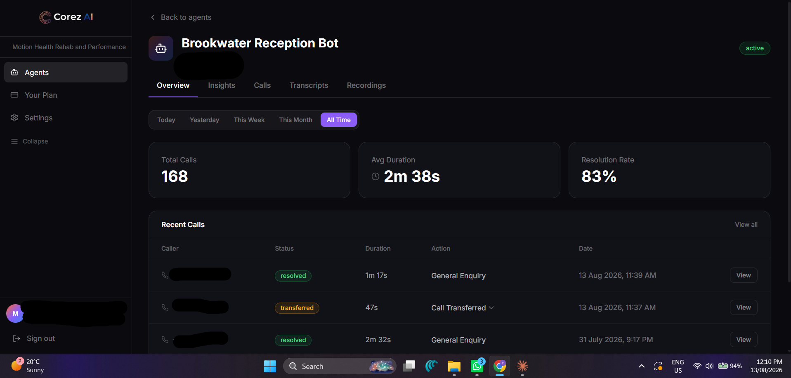
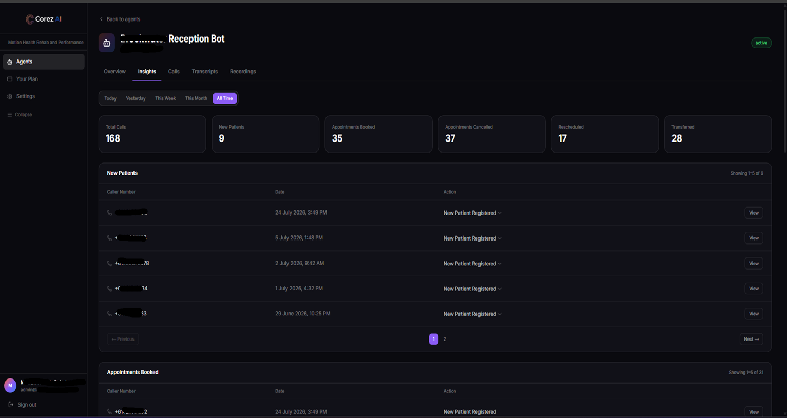
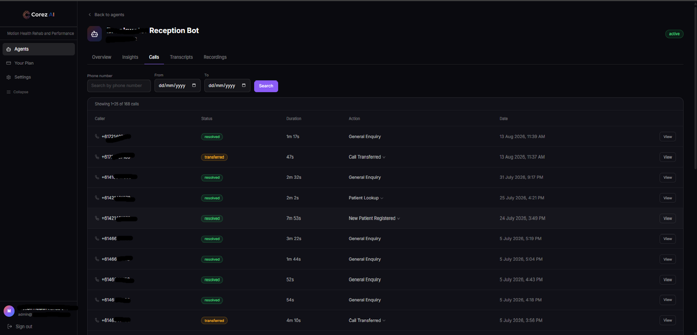
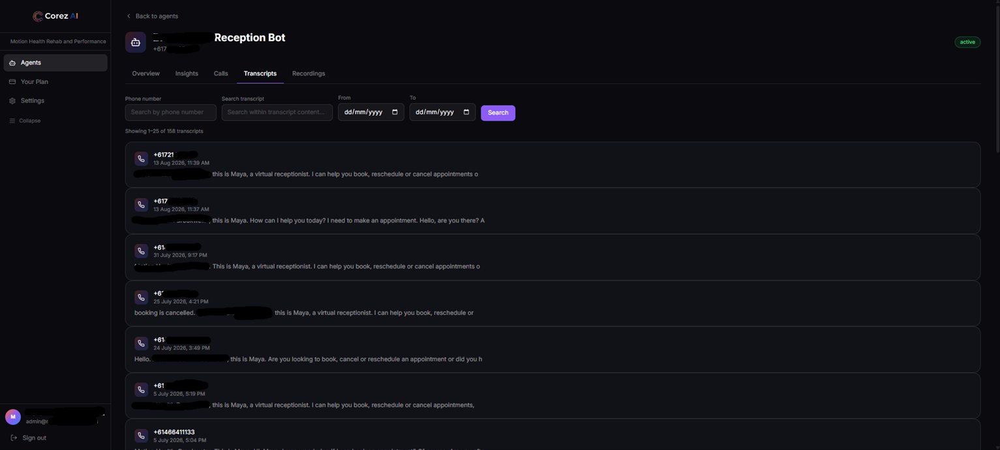
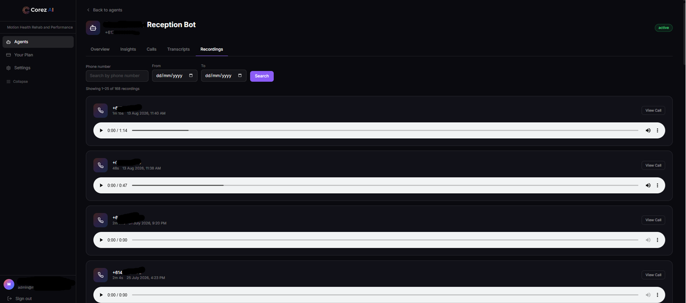

# CorezAI — Voice Agent Analytics Dashboard

> A production SaaS analytics dashboard for AI-powered voice receptionist agents, built for Australian healthcare practices.


---

## 🚀 Live in Production

**[app.corezai.com](https://app.corezai.com)** — actively used by healthcare clients in Brisbane, Australia.

The system runs across two private production repositories:
- **corezva** — this Next.js 14 dashboard
- **corezva-agent** — Python voice agent server (Pipecat · Deepgram · ElevenLabs · OpenAI · Twilio)

---

## 📌 Overview

CorezAI gives healthcare practice managers complete visibility into their AI voice receptionist — every call, transcript, recording, appointment outcome, and billing minute in one place.

The AI agent handles inbound calls autonomously — booking, cancelling, and rescheduling appointments, registering new patients, and transferring complex queries to reception. This dashboard surfaces everything that agent does in a clean, actionable interface.

---

## 🖥️ Screenshots

### Login


### Overview


### Insights


### Calls


### Transcripts


### Recordings


### Call Detail


---

## ✨ Features

### 📊 Overview Tab
- Live stat cards — Total Calls, Avg Duration, Resolution Rate
- One-click quick filters: Today · Yesterday · This Week · This Month · All Time
- Recent calls table with action column and status badges

### 🔍 Insights Tab
- Actionable patient outcome tracking across 5 sections — New Patients, Appointments Booked, Cancelled, Rescheduled, Calls Transferred
- Each section independently paginated with date filtering
- 6 stat cards giving instant period summary

### 📞 Calls Tab
- Server-side pagination across 168+ live call records
- Phone number search with live debounced input
- Date range filters with Brisbane timezone correct logic
- Priority-based action column — parses comma-separated AI logs into single highest-priority outcome
- Action dropdown showing full call journey on demand

### 📝 Transcripts Tab
- Full-text transcript search across all call content
- Two-sided chat bubble UI — agent left/purple vs caller right/grey
- Automatic speaker detection from raw transcript text
- Live search — updates as you type

### 🎙️ Recordings Tab
- Custom dark-themed audio player built entirely in React
- Consistent rendering across macOS, Windows, Chrome, Safari
- No native browser controls — fully custom seekbar, play/pause, volume

### 💳 Billing Module
- Real-time minutes usage calculated directly from call duration data
- No cached counters — always accurate
- Automatic billing period rollover when period expires

### 🔒 Security
- Full multi-tenant isolation — every Prisma query scoped to session clientId
- URL parameter ownership verified on all dynamic routes
- Silent redirect on unauthorized access attempts
- Auth guard on recordings API — 401 for unauthenticated requests

---

## 🛠️ Tech Stack

| Technology | Purpose |
|-----------|---------|
| Next.js 14 (App Router) | Framework, server components, API routes |
| TypeScript | End-to-end type safety |
| React 18 | Component architecture, custom hooks |
| Prisma ORM | Type-safe database access |
| PostgreSQL | Primary database |
| NextAuth.js | Session-based authentication |
| Tailwind CSS | Utility-first styling |
| Twilio | Call recording proxy with auth |

---

## ⚙️ Key Implementation Details

- **Timezone-correct filtering** — all date logic uses Brisbane UTC+10, independent from/to date bounds, quick-select presets calculated server-side
- **Priority action system** — parses comma-separated AI agent action logs into single highest-priority outcome: NewPatientCreated > BookedAppointment > CancelledAppointment > RescheduledAppointment > TransferredCall
- **Custom audio player** — built from scratch in React with no native audio controls, eliminating cross-browser rendering inconsistencies between macOS and Windows
- **Automatic speaker detection** — transcript parser scans raw text to detect agent name dynamically, renders two-sided chat UI without hardcoded names
- **Multi-tenant security** — clientId scoping on every query, dynamic route parameter ownership verification, production security audit conducted and vulnerabilities remediated
- **Real-time billing** — minutes aggregated from call duration on every page load, never from a stale cached counter

---

## 👤 Role & Contribution

**Technical Lead & Product Owner** across a two-developer team:
- Architected the full-stack feature set from requirements to production
- Directed 60+ implementation cycles using AI-assisted development
- Conducted full security audit — identified and closed unauthenticated API endpoint
- Managed git workflow, coordinated concurrent feature branches, reviewed all changes
- Designed UX/UI decisions including filter logic, action priority system, and transcript layout

---

## 📁 Project Structure

```
src/
├── app/
│   ├── (authenticated)/
│   │   └── (dashboard)/
│   │       ├── agents/[agentId]/
│   │       │   ├── page.tsx
│   │       │   ├── insights/
│   │       │   ├── calls/
│   │       │   ├── transcripts/
│   │       │   └── recordings/
│   │       ├── plan/
│   │       └── settings/
│   └── api/
│       └── recordings/[sid]/
├── components/
│   └── audio-player.tsx
└── lib/
    └── utils.ts
prisma/
└── schema.prisma
```

---

## 📄 Note

This repository is for portfolio documentation purposes only.
All production code is maintained privately under the CorezAI organisation.
